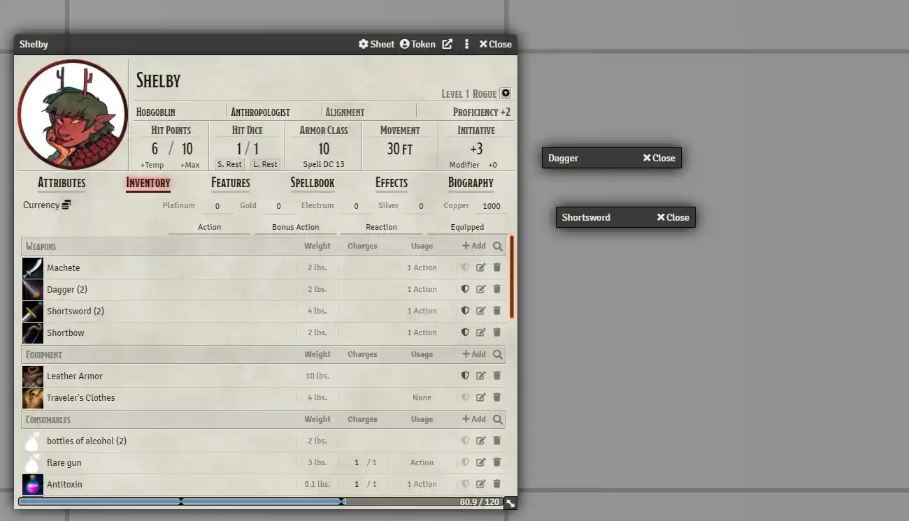
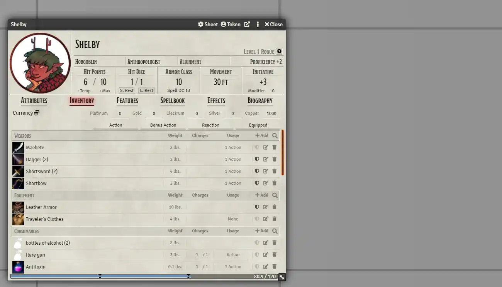

# [QoL - Maximize Reopened Sheets](https://foundryvtt.com/packages/qol-maximize-reopened-sheets/)

 
 
  

When trying to render a sheet window that is already opened, maximize it and bring it in front of other sheets (instead
of doing nothing).

This applies to most types of "sheets" (item, actor, journal, token configuration, etc).  Due to some core bugs it
 doesn't work with drawing config, folder config, or user config.

Compare this to the default behavior, which may frustrate some users:

This tiny module also includes a settings option to disable it for the current user.